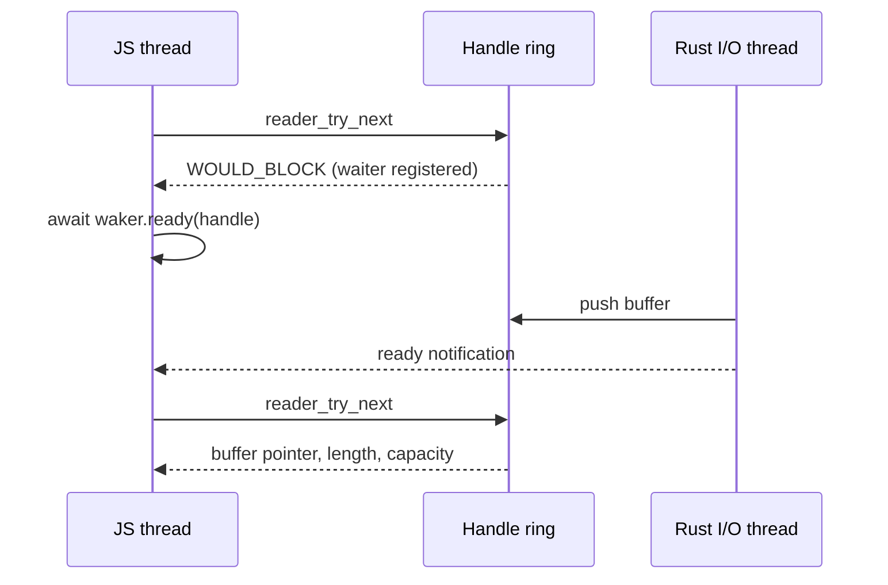

# Behaviour

## I/O Model

Each reader or writer handle owns one Rust thread and a bounded ring of
buffers. JS calls only non-blocking entry points that return a buffer, end of
file, an error or `WOULD_BLOCK`. On `WOULD_BLOCK` the native side records that
a JS waiter exists, and the JS side awaits the waker until the I/O thread
reports the handle ready.

## Reading

- The stream yields `NativePayload` items on the `host` domain. Each item is
  one buffer read from the file, which costs one copy from the page cache.
- `release()` returns the buffer to the Rust allocator and is idempotent.
- `readRange(start, end)` opens an independent reader over the range with an
  exclusive `end` clamped to the end of the file.
- `readInto(lease)` has the reader thread read directly into the lease buffer.

## Writing

- The stream copies each item into the writer's queue and then releases it, so
  a writer applies backpressure by waiting when the queue is full.
- `acquire()` leases one of the writer's own buffers. Committing queues it for
  writing, and releasing without committing returns it to the pool.
- `resumeToken()` reports the bytes written, plus the start offset. Resuming
  reopens the file for append from its current size, reported as `startOffset`.

## Payload Converters

- `native[host]` to `js` views a buffer from this plugin in place, and
  ownership moves to the garbage collector, which frees it through a native
  deallocator. The source payload is not released again. A payload from another
  source is copied and released.
- `js` to `native[host]` points at the bytes of the existing `Uint8Array` and
  keeps it referenced until `release()`.
